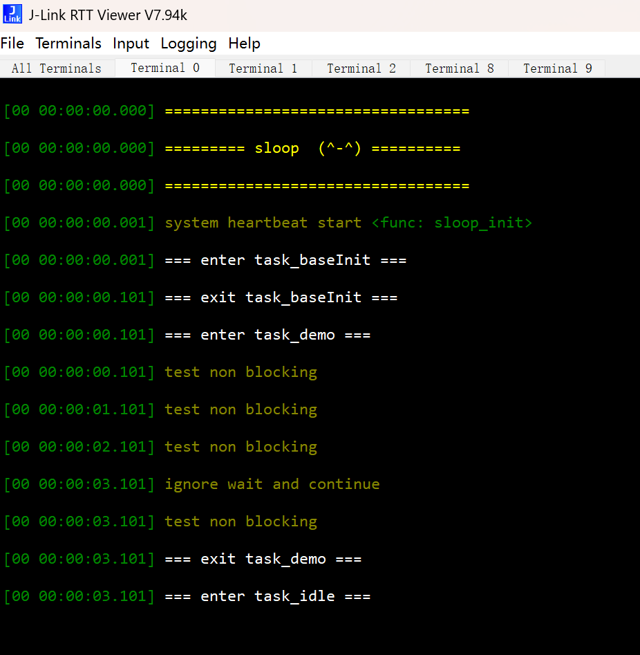

# sloopLite

轻量级嵌入式裸机单线程协作式任务调度管理框架

## 项目简介

sloopLite是一个专为STM32G0系列微控制器设计的轻量级嵌入式任务调度框架。它采用单线程协作式调度模型，提供了丰富的任务管理功能，同时保持极低的资源消耗，非常适合资源受限的嵌入式应用开发。

## 主要特性

### 任务管理
- **超时任务**：延迟指定时间后执行一次
- **周期任务**：按照固定时间间隔重复执行
- **多次任务**：执行指定次数的周期任务
- **并行任务**：在主循环中并行执行
- **单次任务**：只执行一次，适合中断中复杂逻辑下放
- **互斥任务**：通过函数指针实现任务切换

### 系统服务
- **RTT日志输出**：基于SEGGER RTT的高效日志系统
- **CPU负载监测**：实时计算和显示系统负载
- **系统心跳**：定期输出系统状态
- **非阻塞等待**：支持任务间的延时和同步
- **时间戳功能**：提供系统时间获取接口

### 设计优势
- **轻量级**：代码精简，资源消耗低
- **易用性**：简洁直观的API设计
- **可配置**：支持任务数量等参数配置
- **低延迟**：高效的任务调度算法
- **可扩展**：模块化设计，便于功能扩展

## 技术规格

### 硬件要求
- **微控制器**：STM32G0系列
- **内存**：至少4KB RAM
- **Flash**：至少32KB Flash

### 软件要求
- **开发环境**：Keil MDK-ARM 5.x+
- **编译器**：ARM Compiler 6
- **STM32 HAL库**：STM32G0xx HAL Driver

### 资源消耗
```
Total RO Size (Code + RO Data):  18648 bytes (18.21kB)
Total RW Size (RW Data + ZI Data):  3840 bytes (3.75kB)
Total ROM Size (Code + RO Data + RW Data):  18660 bytes (18.22kB)
```

## 快速开始

### 环境搭建
1. 安装Keil MDK-ARM 5.x+
2. 安装STM32G0系列支持包
3. 克隆或下载sloopLite项目
4. 使用Keil MDK打开`project/MDK-ARM/project.uvprojx`

### 项目编译
1. 选择目标设备（STM32G030K8Tx）
2. 配置编译选项
3. 点击编译按钮（F7）
4. 生成的固件位于`project/MDK-ARM/bin/project.hex`

### 项目结构

```
├── project/
│   ├── Core/             # 核心系统文件
│   ├── Drivers/          # STM32 HAL和CMSIS库
│   ├── MDK-ARM/          # Keil项目文件
│   └── user/             # 用户应用代码
│       ├── app/          # 应用层
│       │   ├── config/   # 配置文件
│       │   └── tasks/    # 任务实现
│       └── sloop/        # 框架核心
│           ├── RTT/      # SEGGER RTT库
│           └── kernel/   # 内核实现
├── LICENSE               # 许可证文件
└── README.md             # 项目文档
```

## 核心API

### 系统初始化
```c
// 初始化sloopLite框架
void sloop_init(void);

// 运行sloopLite框架
void sloop(void);
```

### 任务管理

#### 超时任务
```c
// 启动超时任务
void sl_timeout_start(int ms, pfunc task);

// 停止超时任务
void sl_timeout_stop(pfunc task);
```

#### 周期任务
```c
// 启动周期任务
void sl_cycle_start(int ms, pfunc task);

// 停止周期任务
void sl_cycle_stop(pfunc task);
```

#### 多次任务
```c
// 启动多次任务
void sl_multiple_start(int num, int ms, pfunc task);

// 停止多次任务
void sl_multiple_stop(pfunc task);
```

#### 并行任务
```c
// 启动并行任务
void sl_task_start(pfunc task);

// 停止并行任务
void sl_task_stop(pfunc task);
```

#### 单次任务
```c
// 启动单次任务
void sl_task_once(pfunc task);
```

#### 互斥任务
```c
// 切换到指定任务
void sl_goto(pfunc task);
```

### 时间管理
```c
// 获取系统时间戳
uint32_t sl_get_tick(void);

// 阻塞式延时
void sl_delay(int ms);

// 非阻塞等待
char sl_wait(int ms);

// 非阻塞裸等待
char sl_wait_bare(void);
```

### 日志输出
```c
// 打印日志（带时间戳）
sl_printf("Hello, sloopLite!");

// 打印变量
sl_prt_var(counter);

// 打印浮点数
sl_prt_float(temperature);
```
#### RTT终端效果


通过J-Link RTT Viewer可以实时查看框架输出的日志信息，包括：
- 系统初始化信息
- 任务进入/退出日志
- 周期任务执行记录
- 系统心跳监测
- CPU负载信息
## 使用示例
### 创建周期任务

```c
#include "common.h"

// 定义测试任务
void test_task(void)
{
    static int counter = 0;
    sl_prt_var(counter++);
}

// 主任务
void main_task(void)
{
    _INIT;
    
    // 启动周期任务（每秒执行一次）
    sl_cycle_start(1000, test_task);
    
    _FREE;
    sl_cycle_stop(test_task);
    
    _RUN;
    
    // 等待用户中断
    if (sl_wait_bare())
        return;
    
    // 切换到空闲任务
    sl_goto(task_idle);
}
```

### 超时任务示例

```c
#include "common.h"

// 定义超时回调函数
void timeout_callback(void)
{
    sl_printf("Timeout reached!");
    sl_wait_continue();
}

// 主任务
void main_task(void)
{
    _INIT;
    
    // 3秒后执行超时任务
    sl_timeout_start(3000, timeout_callback);
    
    _FREE;
    
    _RUN;
    
    // 等待超时或中断
    if (sl_wait_bare())
        return;
    
    // 切换到下一个任务
    sl_goto(next_task);
}
```

## 配置文件

主要配置文件位于`project/user/app/config/sl_config.h`，可以根据需要调整以下参数：

```c
// 超时任务上限
#define TIMEOUT_LIMIT 16

// 周期任务上限
#define CYCLE_LIMIT 16

// 多次任务上限
#define MULTIPLE_LIMIT 16

// 并行任务上限
#define PARALLEL_TASK_LIMIT 32

// 单次任务上限
#define ONCE_TASK_LIMIT 16

// 启用RTT打印
#define SL_RTT_ENABLE 1
```

## 注意事项

1. **任务设计**：互斥任务需要使用`_INIT`、`_FREE`和`_RUN`宏来管理任务的生命周期
2. **资源限制**：每种任务类型都有数量上限，超过上限会导致任务创建失败
3. **实时性**：由于采用协作式调度，任务需要主动让出CPU资源
4. **中断处理**：中断中应避免执行复杂逻辑，建议使用`sl_task_once()`将复杂逻辑下放
5. **内存管理**：框架不提供动态内存管理，需要用户自行管理内存

## 许可证

本项目采用MIT许可证，详见LICENSE文件。

## 贡献

欢迎提交Issue和Pull Request来改进sloopLite框架。

---

sloopLite - 轻量级嵌入式任务调度框架


# English Version

Lightweight Embedded Bare-Metal Single-Threaded Cooperative Task Scheduling Framework

## Project Introduction

sloopLite is a lightweight embedded task scheduling framework designed specifically for STM32G0 series microcontrollers. It adopts a single-threaded cooperative scheduling model, providing rich task management functions while maintaining extremely low resource consumption, making it very suitable for resource-constrained embedded application development.

## Main Features

### Task Management
- **Timeout Task**: Execute once after a specified delay
- **Cycle Task**: Repeat execution at fixed time intervals
- **Multiple Task**: Execute periodic tasks for a specified number of times
- **Parallel Task**: Execute in parallel in the main loop
- **Once Task**: Execute only once, suitable for offloading complex logic from interrupts
- **Mutex Task**: Task switching through function pointers

### System Services
- **RTT Log Output**: Efficient logging system based on SEGGER RTT
- **CPU Load Monitoring**: Real-time calculation and display of system load
- **System Heartbeat**: Periodic output of system status
- **Non-blocking Wait**: Support for delay and synchronization between tasks
- **Timestamp Function**: Provides system time acquisition interface

### Design Advantages
- **Lightweight**: Compact code with low resource consumption
- **Ease of Use**: Simple and intuitive API design
- **Configurable**: Supports configuration of parameters such as task quantity
- **Low Latency**: Efficient task scheduling algorithm
- **Extensible**: Modular design for easy function expansion

## Technical Specifications

### Hardware Requirements
- **Microcontroller**: STM32G0 series
- **Memory**: At least 4KB RAM
- **Flash**: At least 32KB Flash

### Software Requirements
- **Development Environment**: Keil MDK-ARM 5.x+
- **Compiler**: ARM Compiler 6
- **STM32 HAL Library**: STM32G0xx HAL Driver

### Resource Consumption
```
Total RO Size (Code + RO Data):  18648 bytes (18.21kB)
Total RW Size (RW Data + ZI Data):  3840 bytes (3.75kB)
Total ROM Size (Code + RO Data + RW Data):  18660 bytes (18.22kB)
```

## Quick Start

### Environment Setup
1. Install Keil MDK-ARM 5.x+
2. Install STM32G0 series support package
3. Clone or download the sloopLite project
4. Open `project/MDK-ARM/project.uvprojx` using Keil MDK

### Project Compilation
1. Select the target device (STM32G030K8Tx)
2. Configure compilation options
3. Click the compile button (F7)
4. The generated firmware is located at `project/MDK-ARM/bin/project.hex`

### Project Structure

```
├── project/
│   ├── Core/             # Core system files
│   ├── Drivers/          # STM32 HAL and CMSIS libraries
│   ├── MDK-ARM/          # Keil project files
│   └── user/             # User application code
│       ├── app/          # Application layer
│       │   ├── config/   # Configuration files
│       │   └── tasks/    # Task implementations
│       └── sloop/        # Framework core
│           ├── RTT/      # SEGGER RTT library
│           └── kernel/   # Kernel implementation
├── LICENSE               # License file
└── README.md             # Project documentation
```

## Core API

### System Initialization
```c
// Initialize the sloopLite framework
void sloop_init(void);

// Run the sloopLite framework
void sloop(void);
```

### Task Management

#### Timeout Task
```c
// Start a timeout task
void sl_timeout_start(int ms, pfunc task);

// Stop a timeout task
void sl_timeout_stop(pfunc task);
```

#### Cycle Task
```c
// Start a cycle task
void sl_cycle_start(int ms, pfunc task);

// Stop a cycle task
void sl_cycle_stop(pfunc task);
```

#### Multiple Task
```c
// Start a multiple task
void sl_multiple_start(int num, int ms, pfunc task);

// Stop a multiple task
void sl_multiple_stop(pfunc task);
```

#### Parallel Task
```c
// Start a parallel task
void sl_task_start(pfunc task);

// Stop a parallel task
void sl_task_stop(pfunc task);
```

#### Once Task
```c
// Start a once task
void sl_task_once(pfunc task);
```

#### Mutex Task
```c
// Switch to the specified task
void sl_goto(pfunc task);
```

### Time Management
```c
// Get system timestamp
uint32_t sl_get_tick(void);

// Blocking delay
void sl_delay(int ms);

// Non-blocking wait
char sl_wait(int ms);

// Non-blocking bare wait
char sl_wait_bare(void);
```

### Log Output
```c
// Print log (with timestamp)
sl_printf("Hello, sloopLite!");

// Print variable
sl_prt_var(counter);

// Print float
sl_prt_float(temperature);
```

#### RTT Terminal Effect


Real-time log information output by the framework can be viewed through J-Link RTT Viewer, including:
- System initialization information
- Task entry/exit logs
- Cycle task execution records
- System heartbeat monitoring
- CPU load information

## Usage Examples

### Creating a Cycle Task

```c
#include "common.h"

// Define test task
void test_task(void)
{
    static int counter = 0;
    sl_prt_var(counter++);
}

// Main task
void main_task(void)
{
    _INIT;
    
    // Start cycle task (execute every second)
    sl_cycle_start(1000, test_task);
    
    _FREE;
    sl_cycle_stop(test_task);
    
    _RUN;
    
    // Wait for user interrupt
    if (sl_wait_bare())
        return;
    
    // Switch to idle task
    sl_goto(task_idle);
}
```

### Timeout Task Example

```c
#include "common.h"

// Define timeout callback function
void timeout_callback(void)
{
    sl_printf("Timeout reached!");
    sl_wait_continue();
}

// Main task
void main_task(void)
{
    _INIT;
    
    // Execute timeout task after 3 seconds
    sl_timeout_start(3000, timeout_callback);
    
    _FREE;
    
    _RUN;
    
    // Wait for timeout or interrupt
    if (sl_wait_bare())
        return;
    
    // Switch to next task
    sl_goto(next_task);
}
```

## Configuration File

The main configuration file is located at `project/user/app/config/sl_config.h`, and you can adjust the following parameters as needed:

```c
// Timeout task limit
#define TIMEOUT_LIMIT 16

// Cycle task limit
#define CYCLE_LIMIT 16

// Multiple task limit
#define MULTIPLE_LIMIT 16

// Parallel task limit
#define PARALLEL_TASK_LIMIT 32

// Once task limit
#define ONCE_TASK_LIMIT 16

// Enable RTT print
#define SL_RTT_ENABLE 1
```

## Notes

1. **Task Design**: Mutex tasks need to use `_INIT`, `_FREE`, and `_RUN` macros to manage task lifecycle
2. **Resource Limits**: Each task type has a predefined quantity limit, exceeding the limit will cause task creation to fail
3. **Real-time Performance**: Due to the adoption of cooperative scheduling, tasks need to actively yield CPU resources
4. **Interrupt Handling**: Complex logic should be avoided in interrupts; it is recommended to use `sl_task_once()` to offload complex logic
5. **Memory Management**: The framework does not provide dynamic memory management; users need to manage memory themselves

## License

This project adopts the MIT license, please refer to the LICENSE file for details.

## Contribution

Welcome to submit Issues and Pull Requests to improve the sloopLite framework.

---

sloopLite - Lightweight Embedded Task Scheduling Framework